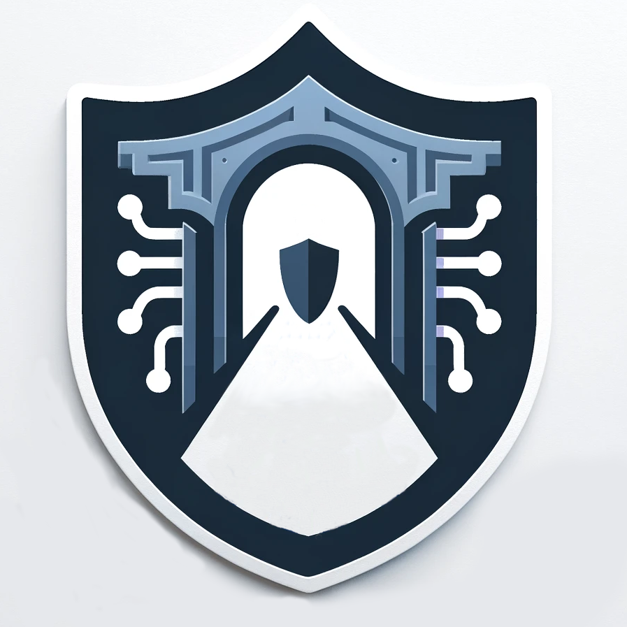

<a name="readme-top"></a>


<!-- PROJECT SHIELDS -->
<!--
*** I'm using markdown "reference style" links for readability.
*** Reference links are enclosed in brackets [ ] instead of parentheses ( ).
*** See the bottom of this document for the declaration of the reference variables
*** for contributors-url, forks-url, etc. This is an optional, concise syntax you may use.
*** https://www.markdownguide.org/basic-syntax/#reference-style-links
-->
[![Contributors][contributors-shield]][contributors-url]
[![Forks][forks-shield]][forks-url]
[![Stargazers][stars-shield]][stars-url]
[![Issues][issues-shield]][issues-url]
[![MIT License][license-shield]][license-url]

<!-- PROJECT LOGO -->
<br />
<div align="center">
  

  <h3 align="center">shadesmar</h3>

  <p align="center">
    A userspace networking stack for virtual machines
    <br />
    <a href="https://github.com/kvnallsn/shadesmar/issues/new?labels=bug">Report Bug</a>
    ·
    <a href="https://github.com/kvnallsn/shadesmar/issues/new?labels=enhancement">Request Feature</a>
  </p>
</div>


<!-- TABLE OF CONTENTS -->
<details>
  <summary>Table of Contents</summary>
  <ol>
    <li>
      <a href="#about-the-project">About The Project</a>
    </li>
    <li>
      <a href="#getting-started">Getting Started</a>
      <ul>
        <li><a href="#prerequisites">Prerequisites</a></li>
        <li><a href="#installation">Installation</a></li>
      </ul>
    </li>
    <li><a href="#quickstart">Quickstart</a></li>
    <li><a href="#configuration">Configuration</a></li>
    <li><a href="#usage">Usage</a></li>
    <li><a href="#contributing">Contributing</a></li>
    <li><a href="#license">License</a></li>
  </ol>
</details>


<!-- ABOUT THE PROJECT -->
## About The Project
shadesmar is a userspace networking stack with support for Qemu virtual machines via the vhost-user protocol.  It includes a layer 2 switch, layer 3 router, and a few different WAN connection types (WireGuard, blackhole, udp, tap). It supports logging traffic, a dynamic routing table and WANs, split-WAN configurations, and includes a basic DHCPv4 server to simplify virtual machine setup.

<p align="right">(<a href="#readme-top">back to top</a>)</p>


<!-- GETTING STARTED -->
## Getting Started

If you plan to build from source, shadesmar is built using Rust. See the prerequisites section for how to install it before continuing.

### Prerequisites

* Rust / Cargo 1.75+
  ```sh
  curl --proto '=https' --tlsv1.2 -sSf https://sh.rustup.rs | sh
  ```

### Installation

1. Clone the repo
   ```sh
   git clone https://github.com/kvnallsn/shadesmar.git
   ```

2. Build the executables
   ```sh
   cargo build --release
   ```

3. Create the required directories and ensure user has access
   ```sh
   sudo mkdir -p /etc/shadesmar
   sudo mkdir -p /var/lib/shadesmar
   sudo mkdir -p /var/run/shadesmar

   sudo chown $USER /etc/shadesmar
   sudo chown $USER /var/lib/shadesmar
   sudo chown $USER /var/run/shadesmar
   ```

> [!NOTE]
> The executable (`shadesmar`) will be located in the `target/release` folder.

<p align="right">(<a href="#readme-top">back to top</a>)</p>

## Quickstart

> [!IMPORTANT]
> This example assumes a network configuration file exist in the current directory and is named `orion.yml`

### Install and Start the Network
The following two commands will install a new network, start it, and wait for VMs to connect.

```console
$ shadesmar install -v orion.yml
$ shadesmar net -v orion start
```

### Connect a Qemu Virtual Machine

For a qemu virtual machine to use the network, the host must be able to access guest memory (memory-backend-memfd/numa) and a vhost-user chardev/netdev/device must be specified.


The following shows an example of the minimum flags that must be specified to interface with a shadesmar network named `orion`:
```sh
qemu-system-x86_64 \
    - <...> \    # all other flags (-M, -enable-kvm, -m, etc.)
    -object memory-backend-memfd,id=mem,size=512m,share=on \  # size must match -m flag
    -numa node,memdev=mem \                                   
    -chardev socket,id=chr0,path=/var/run/shadesmar/orion/vhost.sock \
    -netdev type=vhost-user,id=net0,chardev=chr0,queues=1 \
    -device virtio-net-pci,netdev=net0,mac=00:56:50,de:ad:00
```

<p align="right">(<a href="#readme-top">back to top</a>)</p>

## Configuration

`shadesmar` is configured using a YAML file to specify the network's settings (such as router subnet and DHCP).

The network supports an optional WAN configuration that will be used to forward all non-local traffic (aka traffic not destined for other devices in the subnet).  The following WAN providers exist or under development:
| Type       | Config Key | Status            | Description                                           |
| ---------- | ---------- | ----------------- | ------------------------------------------------------|
| Blackhole  | blackhole  | functioning       | Logs (via PCAP) and drops all traffic                 |
| WireGuard  | wireguard  | functioning       | Encrypts and forwards traffic to a WireGuard endpoint |
| UDP        | udp        | functioning       | Forwards all traffic to the specified UDP endpoint    |
| TAP Device | tap        | under development | Exposes traffic to host device/network                |

Below is a sample configuration for a router serving the `10.67.213.0/24` subnet:  
- Wan section explaination:
  - Create a blackhole device that will drop all traffic it receives
  - Create a WireGuard device with the specified parameters

- Router section explaination:
  - Set to IPv4 address + subnet of the router to `10.67.213.1/24`
  - Enable DHCP server, with an address range of `10.67.213.100` - `10.67.213.200`
  - Disable internal DNS server (_not implemented yet_)
  - Configure the routing table
    - Drop any traffic without an explicit route (i.e., the default route is a blackhole device)
    - Route traffic to `1.1.1.1/32` over the "dns-route" wan device


```yaml
wan:
  - name: blackhole
    pcap: true
    device:
        type: blackhole
  - name: dns-route
    pcap: false
    device:
        type: wireguard
        key: ---secret key goes here---
        peer: ---peer public key here---
        endpoint: ---endpoint socket address here---
        ipv4: ---assigned ipv4 address for private key---

router:
    ipv4: 10.67.213.1/24
    dhcp:
     start: 10.67.213.100
      end: 10.67.213.200
    dns: false
    table:
        0.0.0.0/0: blackhole    # default route
        1.1.1.1/32: dns-route
```

<p align="right">(<a href="#readme-top">back to top</a>)</p>

<!-- USAGE EXAMPLES -->
## Usage

`shadesmar` creates a new userspace networking stack. Qemu virtual machines can connect through the vhost-user socket for individual networks.  Below are some sample commands to execute various different tasks.

### Install / Create a Network
```sh
shadesmar install ./path/to/config.yml
```

Installs a network configuration into the net config directory (default: `/var/lib/shadesmar/<network>/`).

By default, the network name will be taken from the name of the configuration file.  For example, a installing the config `orion.yml` would create a new network named `orion`.  The name can be manually specified using the `-n` flag.

### Start a Network
```sh
shadesmar net <network> start
```

After a network has been installed, it can be started. Starting a network runs in the foreground.  Daemonization has not been added/supported yet.

### Stop a Network
```sh
shadesmar net <network> stop
```

A network may be stopped in a few different ways:
- Use the shadesmar cli to issue a stop command
- Sending a SIGINT (ctrl-c) or SIGTERM signal to the process id

It is recommended to ensure all connected virtual machines have been stopped/disconnected before stopping a network.  Stopping a network which still has conencted virtual machines is undefined behavior.

### Check Network Status
```sh
shadesmar net <network> status
```

The status command will print the status of the router, WAN interfaces, current routing table, and switch port status of a network.

Example output:
```console
$ shadesmar status orion
Router Status:
MAC:      52:54:00:2b:89:7b
Network:  10.10.10.1/24

WAN Interfaces:
┌──────────────────────────────────────────────────────────────────────────────┐
│        Name        │  Status  │     Type     │      TX       │      RX       │
├──────────────────────────────────────────────────────────────────────────────┤
│ new-jersey         │ running  │ WireGuard    │           0 B │           0 B │
│ san-jose           │ running  │ WireGuard    │         644 B │         336 B │
└──────────────────────────────────────────────────────────────────────────────┘

Route Table:
┌──────────────────────────────────────────────────────────────────────────────┐
│     Destination      │         Via          │          Packet Count          │
├──────────────────────────────────────────────────────────────────────────────┤
│ default              │ new-jersey           │ 0                              │
│ 1.1.1.1/32           │ san-jose             │ 4                              │
└──────────────────────────────────────────────────────────────────────────────┘

Switch Status:
┌──────────────────────────────────────────────────────────────────────────────┐
│   Port   │    Type    │                         MACs                         │
├──────────────────────────────────────────────────────────────────────────────┤
│        0 │ router     │ 52:54:00:2b:89:7b                                    │
│        1 │ virtio     │ 00:56:50:de:ad:00                                    │
└──────────────────────────────────────────────────────────────────────────────┘
```

### Examine traffic
```sh
shadesmar net <network> netflow
```

Prints traffic crossing the switch to stdout in a table format.

Example output:
```
| ------------------------------ | ---------- | ----------- | ------------------------------------------------------------ |
|           Date/Time            |  Protocol  |    Size     |                           Details                            |
| ------------------------------ | ---------- | ----------- | ------------------------------------------------------------ |
| 2024-08-16T19:40:09.247570137Z | ipv4/udp   |   328 bytes | 0.0.0.0:68 --> 255.255.255.255:67                            |
| 2024-08-16T19:40:09.247919404Z | ipv4/udp   |   308 bytes | 255.255.255.255:67 --> 0.0.0.0:68                            |
| 2024-08-16T19:40:09.248738349Z | ipv4/udp   |   328 bytes | 0.0.0.0:68 --> 255.255.255.255:67                            |
| 2024-08-16T19:40:09.24904596Z  | ipv4/udp   |   308 bytes | 255.255.255.255:67 --> 0.0.0.0:68                            |
| 2024-08-16T19:40:19.805040673Z | arp        |    28 bytes | who has 10.10.10.1? tell 10.10.10.100                        |
| 2024-08-16T19:40:19.805266919Z | arp        |    28 bytes | 10.10.10.1 is at 52:54:00:07:f8:0a                           |
| 2024-08-16T19:40:19.805783103Z | ipv4/icmp  |    84 bytes | [echo request] 10.10.10.100 --> 1.1.1.1                      |
```

### Add a route
```sh
shadesmar net <network> route add <cidr> <wan-device>
```

Adds a new route to the routing table, ensuring all future traffic will travese the stated wan device.  If the route already exists, it will be updated to use the newly-specified device.

### Delete a route
```sh
shadesmar net <network> route delete <cidr>
```

Removes a route from the routing table. Any future traffic to this cidr will use the default route (i.e., `0.0.0.0/32`)

### Add a WAN device
```sh
shadesmar net <network> wan add <path/to/wan/cfg.yml>
```

Adds a new WAN device that may be used to route traffic. The yaml file must contain all required parameters for the type of wan device being created.

### Delete a WAN device
```sh
shadesmar net <network> wan delete <wan>
```

Stops and deletes a WAN device. If the WAN device has active routes in the routing table, all traffic will be dropped.  Alternatively, the `-a/--clean` option may be specified to remove all associated routes with the WAN device.  In this case, all traffic will fallback to the default route.

<p align="right">(<a href="#readme-top">back to top</a>)</p>


<!-- CONTRIBUTING -->
## Contributing

Contributions are what make the open source community such an amazing place to learn, inspire, and create. Any contributions you make are **greatly appreciated**.

If you have a suggestion that would make this better, please fork the repo and create a pull request. You can also simply open an issue with the tag "enhancement".
Don't forget to give the project a star! Thanks again!

1. Fork the Project
2. Create your Feature Branch (`git checkout -b feature/AmazingFeature`)
3. Commit your Changes (`git commit -m 'Add some AmazingFeature'`)
4. Push to the Branch (`git push origin feature/AmazingFeature`)
5. Open a Pull Request

<p align="right">(<a href="#readme-top">back to top</a>)</p>


<!-- LICENSE -->
## License

Distributed under the MIT License. See `LICENSE.txt` for more information.

<p align="right">(<a href="#readme-top">back to top</a>)</p>


<!-- MARKDOWN LINKS & IMAGES -->
<!-- https://www.markdownguide.org/basic-syntax/#reference-style-links -->
[contributors-shield]: https://img.shields.io/github/contributors/kvnallsn/shadesmarstyle=for-the-badge
[contributors-url]: https://github.com/kvnallsn/shadesmar/graphs/contributors
[forks-shield]: https://img.shields.io/github/forks/kvnallsn/shadesmarstyle=for-the-badge
[forks-url]: https://github.com/kvnallsn/shadesmar/network/members
[stars-shield]: https://img.shields.io/github/stars/kvnallsn/shadesmarstyle=for-the-badge
[stars-url]: https://github.com/kvnallsn/shadesmar/stargazers
[issues-shield]: https://img.shields.io/github/issues/kvnallsn/shadesmar?style=for-the-badge
[issues-url]: https://github.com/kvnallsn/shadesmar/issues
[license-shield]: https://img.shields.io/github/license/kvnallsn/shadesmar?style=for-the-badge
[license-url]: https://github.com/kvnallsn/shadesmar/blob/master/LICENSE.txt
[rust-shield]: https://img.shields.io/badge/rust-orange?style=for-the-badge&logo=rust&logoColor=white
[rust-url]: https://www.rust-lang.org/
